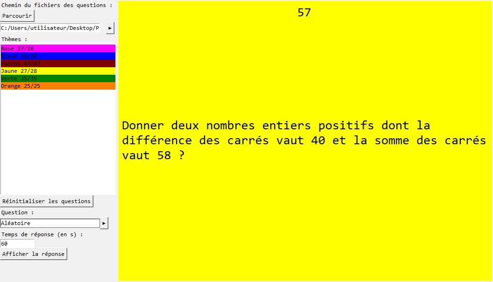

# Python-Quizz

This is a program that can plays quizzes.
## Features
- Question themes
- Colored themes
- Possibility to set the response time
## Installation
1. Download the repository by clicking on `Code > Download ZIP`
2. Extract the ZIP file
3. Run `main.pyw`
## Requirements
- Python 3.7
- Python tkinter library
- Python os library
- Python random library
## Usage
You can load quizz file using the first input.
Quizz files must have a `.txt` extension and contain sequences of 3 lines :
- First line for the question type
- Second line for the question
- Third line for the answer

Questions cannot be asked a second time but if you want to reset them you can click on `Réinitialiser les questions`.